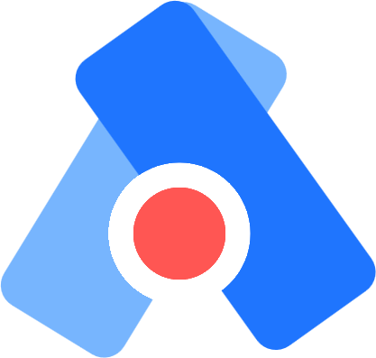

 

    

 

# Acolyte

Il est souvent bénéfique et parfois nécessaire d'avoir recours à des séances de pratique superviser par un expert ou quelqu'un d'accréditer afin d'acquérir une bonne maitrise d'un outil ou d'une technique en toute sécurité. Ce projet vise à créer une plateforme ou une application mettant en relation des individus experts ou accrédités et des apprentis afin d'encadrer l'apprentissage d'un outil ou d'une technique. 

## 📋 Fonctionnalités

## 👥 Roles

## 📅 Échéancier

Le projet se découpe en plusieurs phases. La phase 1 commence à l'hiver 2024 et se concentre sur le prototypage de l'application.

> Début: 18 janvier 2024  
> Fin: 25 avril 2024

Le suivi du projet est présenté dans le fichier [**TIMELINE**](TIMELINE.md).

## 🌐 Infrastructure

### 🗄️ Backend

- [**Firebase**](https://firebase.google.com/): Firebase est une plateforme développée par Google fournissant des services facilitant le développement d'application: Base de données, Authentification, Hébergement.
<!-- 
- JS: Fastify ou Express 
- Python: FastAPI ou Flask -->

### 📱 Application

- [**Flutter**](https://flutter.dev/): Flutter est un kit de développement logiciel (SDK) open source créé par Google, utilisé pour développer des applications pour Android, iOS et le web à partir d'une seule base de code.

# 📘 Documentation

# 🗂️ Organisation

<!-- Les dossiers du répertoire sont organisés comme suit:

- back: contient le code source du backend composé de l'API et de la base de données
- app: contient le code source de l'application
- wiki: contient la documentation du projet -->

# 🌟 Contribution

Le projet est supervisé par Louis-Edouard LAFONTANT.  

## Contributeurs

- Simo HAKIM [@herbrax](https://github.com/herbrax)